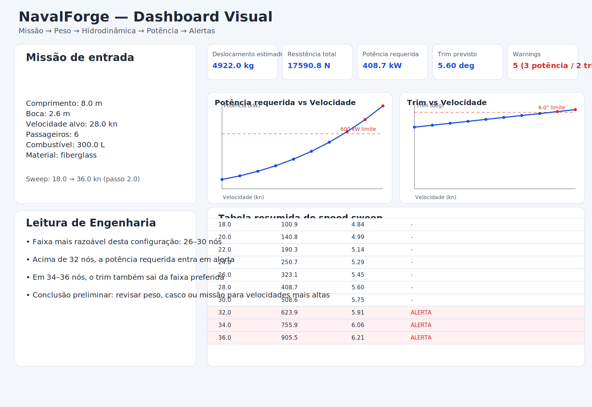

# Exemplo executado com saídas e imagem final

Este exemplo foi executado em **2026-04-28 (UTC)** no repositório NavalForge.

## 1) Demo Savitsky

Comando:

```bash
python examples/run_savitsky_demo.py
```

Saída:

```text
=== SavitskyModel Demo ===
Velocidade (m/s)        : 14.404
Número de Froude        : 2.853
Trim (deg)              : 5.599
Comprimento molhado (m) : 5.523
Coef. de sustentação    : 0.0161
Resistência (N)         : 17590.8
Potência efetiva (kW)   : 253.4
Warnings:
 - Lift coefficient outside typical preliminary Savitsky calibration range.
```

## 2) Speed sweep

Comando:

```bash
python examples/run_speed_sweep.py
```

Saída:

```text
=== NavalForge Speed Sweep ===
speed_knots | estimated_displacement_kg | resistance_n | required_power_kw | trim_deg | warnings
--------------------------------------------------------------------------------------------------------------
       18.0 |                    4922.0 |       6758.8 |             100.9 |     4.84 | none
       20.0 |                    4922.0 |       8484.0 |             140.8 |     4.99 | none
       22.0 |                    4922.0 |      10426.6 |             190.3 |     5.14 | none
       24.0 |                    4922.0 |      12590.1 |             250.7 |     5.29 | none
       26.0 |                    4922.0 |      14977.5 |             323.1 |     5.45 | none
       28.0 |                    4922.0 |      17590.8 |             408.7 |     5.60 | none
       30.0 |                    4922.0 |      20431.1 |             508.6 |     5.75 | none
       32.0 |                    4922.0 |      23498.8 |             623.9 |     5.91 | High installed power predicted (>600 kW). Review hull efficiency and mission targets.
       34.0 |                    4922.0 |      26793.5 |             755.9 |     6.06 | High installed power predicted (>600 kW). Review hull efficiency and mission targets.; Trim angle outside preferred range (2.5-6.0 deg): 6.06 deg.
       36.0 |                    4922.0 |      30313.9 |             905.5 |     6.21 | High installed power predicted (>600 kW). Review hull efficiency and mission targets.; Trim angle outside preferred range (2.5-6.0 deg): 6.21 deg.
```

## 3) Geração do dashboard com imagem final

Comando:

```bash
python examples/generate_dashboard.py --export-svg
```

Saída:

```text
Dashboard HTML criado em:
reports/navalforge_dashboard.html

Para abrir:
abra o arquivo no navegador

Imagem SVG criada em:
reports/navalforge_dashboard.svg
```

Imagem final gerada:


